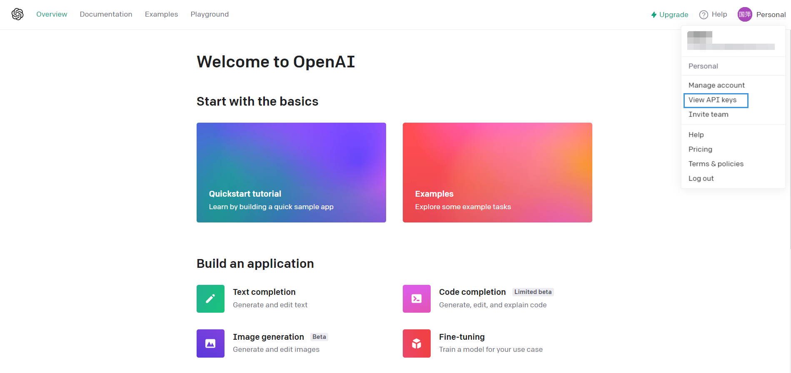
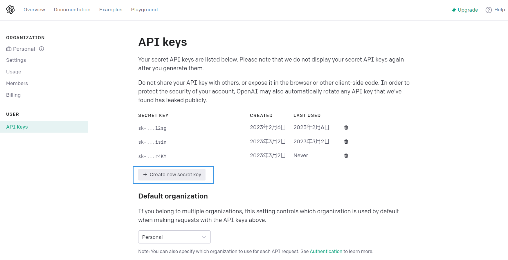

# OpenAI —— Chatgpt API 尝新

<div align="center">
    <a ></a>
</div>

## ChatGPT API 尝新

$\quad$

> 这里简单用了 Open AI 最新的 ChatGPT API `gpt-3.5-turbo`，并且加上了联系上下文功能

$\quad$


### 配置
1. 注册 OpenAI 账号
https://platform.openai.com/


2. 获取 OpenAI API Key


<div align="center">
    <a ></a>
    <a ></a>
</div>


3. 将上面的 Key 更换掉下面代码中的 openai.api_key

首先安装 openai API

```
pip install openai
```

修改 `main.py` 中的 `openai.api_key`


```
# Note: you need to be using OpenAI Python v0.27.0 for the code below to work
# -- coding: utf-8 --
import openai

# please replace the key here with your own key
openai.api_key = "your key"

    ...
```

run
```
python main.py
```